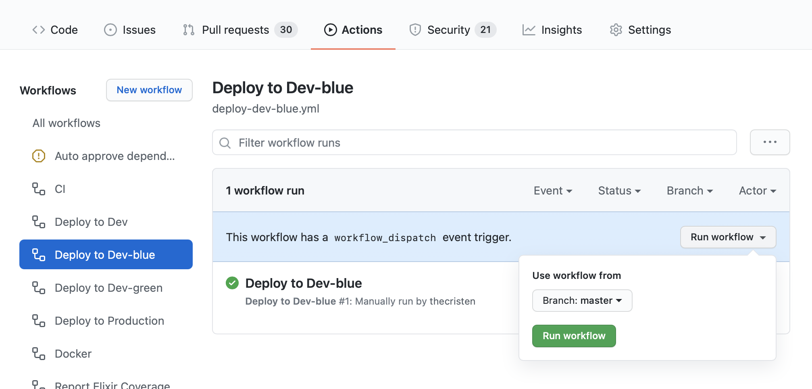
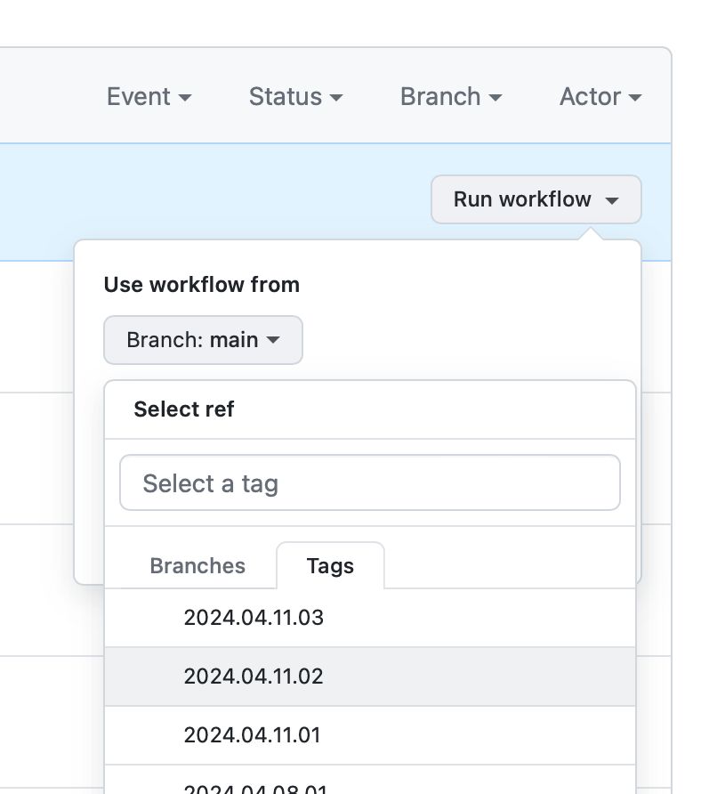

# Deployment

## Production deployment

This can be done on GitHub Actions via the following:

- Create a tag following this format
  - Pull the latest main locally
  - Create a tag `git tag year.month.day.release_number` (ex. `2023.12.18.01`)
  - Push the tag `git push origin --tags`
- [Create a release](https://github.com/mbta/dotcom/releases). Select a relevant tag, follow the naming convention, click "generate release notes", and publish. This will trigger the [Deploy: release](.github/workflows/deploy-release.yml) workflow that will kick off a deploy to production.
- [Manually](https://github.com/mbta/dotcom/actions/workflows/deploy-manual.yml). The [Deploy: selected branch](.github/workflows/deploy-manual.yml) workflow can be used to deploy to production by selecting the "prod" environment.



## Staging deployment

Deploying to our staging servers can also be done through GitHub Actions. In addition to the [Deploy: selected branch](https://github.com/mbta/dotcom/actions/workflows/deploy-manual.yml) option mentioned under "Production deployment", deployment to our staging environments can be done within a pull request by adding the `dev-green` or `dev-blue` labels, which will trigger a deploy to the indicated environment via the [Deploy: PR](.github/workflows/deploy-pr.yml) workflow.

The deployment will be held in a "waiting" state until approved by an active developer. Active developers may approve their own requests.

## Redeploying a previously-deployed release

Use the [Deploy: selected branch](https://github.com/mbta/dotcom/actions/workflows/deploy-manual.yml) workflow. Instead of selecting a branch, select an existing tag from the list. Don't forget to select "prod" and then approve the workflow run.



## Building the distribution package locally

### Using Docker

When deploying to our servers, the `docker/build-push-action@v3` action builds the application for us. But for testing or development purposes it is possible to build locally as well.

1. (once) Install Docker: https://docs.docker.com/engine/install/
2. Build the Docker image:

   - `docker build -t dotcom .`

This will build the release in a Docker container.

The root (three-stage) `Dockerfile` is responsible for building and running the application:

- Build:
  Because most of us develop on a Mac but the servers are Linux, we need to run the build inside a Docker (Elixir) container so that everything is compiled correctly. The build uses `mix release` to make the Erlang release, along with all our dependencies.

- Run:
  The part of the Dockerfile used to run the application (last stage) runs the script that `mix release` provides for us to run the server (`/root/rel/dotcom/bin/dotcom start`). At startup, the `relx` application looks for configuration values that look like `${VARIABLE}` and replaces them with the `VARIABLE` environment variable. This allows us to make a single build, but use it for different environments by changing the environment variables.

Run it locally on port 4000 via `docker run --env-file <filename> -p 4000:4000 dotcom`.

Note the env file format Docker expects is a text file with each line containing a `KEY=value` pair. It's not the same format as used in our conventional `.envrc`.

### Using the release (faster!)

In Elixir, a **release** packages an application into a self-contained directory that includes the Erlang VM, Elixir, and all of the code and dependencies. The configuration for releases is already set up in [mix.exs](mix.exs). To create a release for production, we run `MIX_ENV=prod mix release`.

To run the resulting release at http://localhost:4000:

```shell
MIX_ENV=prod PHX_SERVER=true HOST=localhost PORT=4000 _build/prod/rel/dotcom/bin/dotcom start
```

> [!Warning]
> At the moment, websockets don't work in the locally-running release, [possibly due to a configuration issue](https://stackoverflow.com/a/32589986).

### Recommended environment variables

This applies to either method of building the distribution. For Docker, these variables will need to be passed in explicitly to the `run` command.

```shell
export HOST=localhost
export PORT=4000

# needed for static assets - in production they're hosted on our CDN
export STATIC_HOST=localhost
export STATIC_PORT=4000
export STATIC_SCHEME=http

# override default :info to keep our console readable
export LOGGER_LEVEL=error
```
